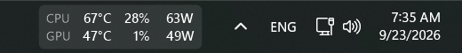
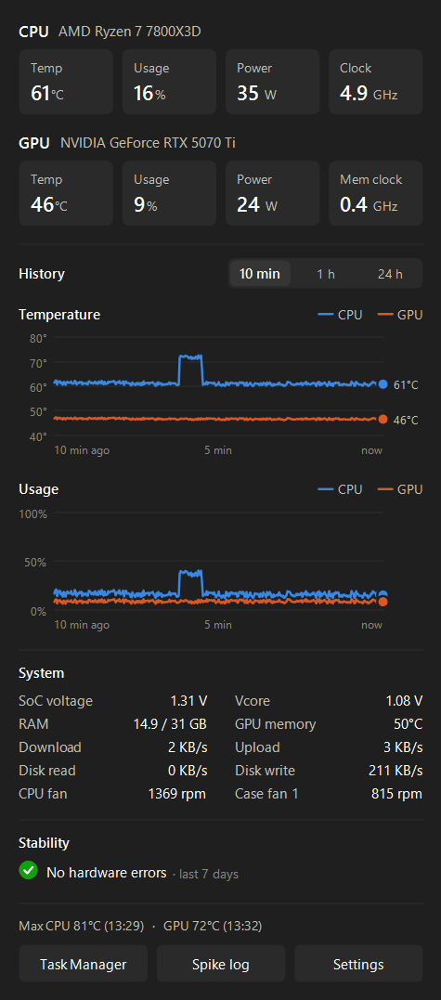
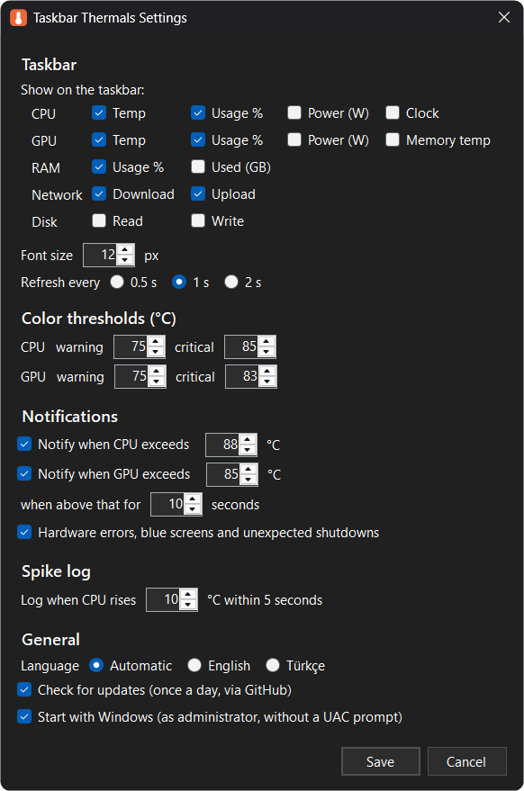

# Taskbar Thermals

Live CPU and GPU temperature and usage right on the Windows 11 taskbar — plus RAM, network and disk if you want them, a 24-hour history panel, temperature-spike logging and a hardware-error watcher for when you're tuning undervolts or BIOS settings.



 

*Details panel and settings. The chart history in the animation is generated sample data.*

## Features

- **Taskbar overlay** — pick what it shows: CPU/GPU temperature, usage, power and clock, GPU memory temperature, RAM usage, network download/upload, disk read/write. Temperatures turn yellow/red past your thresholds. Hides automatically for full-screen games and videos, just like the taskbar.
- **Details panel** (click the overlay) — current temperature, usage, power and clocks; temperature and usage charts for the last 10 minutes, hour or 24 hours with hover readouts; SoC voltage, Vcore, fan speeds, RAM, network, disk; max temperatures. The 24-hour history survives restarts.
- **Spike log** — when the CPU temperature jumps quickly (default: 10 °C within 5 s), the busiest processes at that moment are written to a CSV, so you can see what caused it.
- **Stability watcher** — watches the Windows event log for WHEA hardware errors, blue screens and unexpected shutdowns, and notifies you. Useful when testing Curve Optimizer, SoC voltage or memory settings: press *Mark as seen* before a test, and any new event belongs to the new setting.
- **Notifications** when the CPU or GPU stays above a temperature for too long.
- **Update check** — once a day, tells you when a new release is out.
- English and Turkish UI (follows the Windows display language, or pick one in settings), dark and light theme, per-monitor DPI aware, drag to reposition, starts with Windows.

## Requirements

- Windows 11, x64 (Windows 10 will likely work but is untested)
- [.NET 8 SDK](https://dotnet.microsoft.com/download/dotnet/8.0) only if you build from source
- The [PawnIO](https://pawnio.eu) driver for CPU temperature and motherboard sensors (LibreHardwareMonitor uses it). GPU readings work without it.
- Administrator rights — reading CPU sensors requires them. With autostart enabled the app starts elevated at logon without a UAC prompt.

## Download

Grab the latest build from [Releases](https://github.com/Quenchh/taskbar-thermals/releases/latest):

| File | Size | Needs |
|---|---|---|
| `TaskbarThermals.exe` | ~6 MB | [.NET 8 Desktop Runtime](https://dotnet.microsoft.com/download/dotnet/8.0) |
| `TaskbarThermals-standalone.exe` | ~65 MB | nothing |

Put the exe wherever you like and run it. It asks for administrator rights (needed for CPU temperature). Right-click the overlay → **Start with Windows** to launch it at logon without a UAC prompt. The exe isn't code-signed, so Windows SmartScreen may warn on first run: *More info → Run anyway*.

## Build from source

```powershell
git clone https://github.com/Quenchh/taskbar-thermals.git
cd taskbar-thermals
.\install.ps1              # builds, installs to %LOCALAPPDATA%\Programs\TaskbarThermals, starts with Windows
.\install.ps1 -NoStartup   # same, without autostart
.\uninstall.ps1            # removes the app (settings and logs are kept)
```

Running `install.ps1` again updates an existing installation.

## Usage

| Action | Result |
|---|---|
| Click | Open / close the details panel |
| Drag | Move the overlay along the taskbar |
| Right-click | Menu: Task Manager, spike log, settings, start with Windows, exit |
| Tray icon | Same panel and menu; notifications come from here |

## Files

Everything lives in `%LOCALAPPDATA%\TaskbarThermals`:

| File | Contents |
|---|---|
| `settings.json` | Settings |
| `spikes.csv` | Temperature spikes with the top CPU processes at that moment |
| `history.csv` | Per-minute average, min and max of CPU/GPU temperature and usage for the last 24 hours |
| `errors.log` | Unexpected errors |

## Diagnostics

```powershell
TaskbarThermals.exe --dump sensors.txt   # every sensor + a 20 s series of CPU power/temperature/fan speeds
TaskbarThermals.exe --preview <folder>   # renders the details panel and settings window to PNGs
TaskbarThermals.exe --demo <folder>      # renders the frames of the README animation
```

## Privacy

Nothing leaves your PC except the optional update check: one HTTPS request shortly after start and then once a day to the GitHub API (`api.github.com/repos/Quenchh/taskbar-thermals/releases/latest`) with no data attached. Turn it off in settings.

## Releases

Pushing a `v*` tag builds both executables on GitHub Actions and publishes a release with checksums; notes come from [CHANGELOG.md](CHANGELOG.md).

## How it works

Windows 11 no longer supports taskbar deskbands, so the overlay is a borderless, per-pixel-alpha window kept above the taskbar. Sensors are read with [LibreHardwareMonitor](https://github.com/LibreHardwareMonitor/LibreHardwareMonitor); CPU usage comes from the same performance counter Task Manager uses, so the numbers match.

## License

[MIT](LICENSE) — free to use, modify and distribute, including commercially.

Uses [LibreHardwareMonitorLib](https://github.com/LibreHardwareMonitor/LibreHardwareMonitor), licensed under [MPL-2.0](https://github.com/LibreHardwareMonitor/LibreHardwareMonitor/blob/master/LICENSE).
